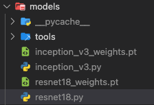

# AirTestbed Manual
A testbed for training and evaluation of our deep learning research based on PyTorch.

</br>

## Environments
---
- Ubuntu 20.04
- python 3.9.12
- pytorch 1.12.1
- CUDA Version: 11.4 

<br/>

## Embedded models
---
### Embedded model list
- inception_v3
- resnet-18
- resnet-152
- vgg-11
- vgg-16
- vgg-19

<br/>

### Load embedded models
- Run 'models/tools/setup.py' to load the embedded model.
- When removing the loaded model, run the 'models/tools/remove.py'   
- Here is an example run 'setup.py', 'remove.py' file.
```bash
$ python models/tools/setup.py
$ python models/tools/remove.py
```
<br/>

### Add other models
[Method 1]
- If you want to add a model, add the model and parameters to 'models/tools/setup.py'.   
- Here is an example setup.py file:
```python
from torchvision import models as torchmodels

models = (
    torchmodels.resnet18,
    torchmodels.resnet152
)
params = (
    torchmodels.ResNet18_Weights.IMAGENET1K_V1,
    torchmodels.ResNet152_Weights.IMAGENET1K_V2
)
```
</br>

[Method 2]
- If you want to add a model, add model.py and model_weights.pt file to ‘AIRTestbed/models’.

 

- Here is an example *.py file:

```python
# example resnet18.py
from torchvision.models import resnet18

def get_model():
    return resnet18()
```
<br/><br/>

## Running Steps
---

### 1. Git Clone AirBed Template code.
```bash
$ git clone https://github.com/AIRLABkhu/AIRTestbed.git
```
or download the zipped archive and unzip.
```bash
$ wget https://github.com/AIRLABkhu/AIRTestbed/archive/refs/heads/main.zip
$ unzip main.zip
$ rm main.zip
```
<br/>

### 2. Datasets Settings
- If you want to add Datasets, you need to add the dataset name, path, and normalization value to 'data/\_\_init\_\_.py'. 

- The dataset name will be used later as a commandline argument.

- Here is an example 'data/\_\_init\_\_.py' file:

```python
# data/__init__.py
class Names:
    imagenet = 'imagenet'

name_root_map = {
    Names.imagenet: '/material/data/imagenet-original/'
}

name_norm_map = {
    Names.imagenet: ((0.485, 0.456, 0.406), (0.229, 0.224, 0.225))
}
```
<br/>
    
- For an adversarial examples dataset, since the dataset is saved as 'torchvision.datasets.ImageFolder', it must be configured in the ImageFolder dataset format.

```
dataset/
    class 0/
        0.jpg
        1.jpg
        ...
    class 1/
        0.jpg
        1.jpg
        ...
    ...
    class 9/
        0.jpg
        1.jpg
        ...
```

- If you use a AirLab library server, ImageNet, Cifar10, and ImageNet Adversarial Examples can be used in the '/material/data' path.   

<br/>

### 3. Models Settings.
- If you use resnet-18, resnet-152, vgg-11, vgg-16, vgg-19, you do not need to set.
- When using other datasets, add model.py and model_weights.pt file to ‘AIRTestbed/models’.
    
    (For the method, refer to ‘Embedded model’ section at the top.)
    
<br/>

### 4. Run main.py according to your case.
    
**Examples are:**  
- VGG16 Evaluation with Adversarial Dataset
    
    ```bash
    $ python main.py -m models/vgg16.py \
    -w models/vgg16_weights.pt \
    -ds imagenet,imagenet_gap_uni_non_tar_vgg16 \
    -is 224x224 -o out_vgg16.csv -l out_vgg16.log -d cuda:0
    ```
    
- InceptionV3 Evaluation with Adversarial Dataset
    
    ```bash
    $ python main.py -m models/inception_v3.py \
    -w models/inception_v3_weights.pt \
    -ds imagenet,imagenet_gap_uni_non_tar_incv3 \
    -is 299x299 -o out_incv3.csv -l out_incv3.log -d cuda:2
    ```
    
- VGG16 Evaluation with Perturbation
    
    ```bash
    $ python main.py -m models/vgg16.py \
    -w models/vgg16_weights.pt \
    -ds imagenet \
    -p vgg16_U_epoch_9_foolrat_80.93944549560547.pth \
    -pm 10 -is 224x224 -o vgg16_out.csv -l vgg16_out.log -d cuda:0
    ```
    
- Inception V3 Evaluation with Perturbation
    
    ```bash
    $ python main.py -m models/inception_v3.py \
    -w models/inception_v3_weights.pt \
    -ds imagenet \
    -p incv3_U_epoch_10_foolrat_66.80900573730469.pth \
    -pm 10 -is 299x299 -o incv3_out.csv -l incv_out.log -d cuda:2
    ```
    
</br>

## Command line descriptions

---

- **Usage Example:**

```bash
python models/tools/setup.py
python models/tools/remove.py
```

```bash
$ python main.py [-h] [--device DEVICE] [--models MODELS] [--weights WEIGHTS] [--datasets DATASETS]
[--input-size INPUT_SIZE] [--normalize-input NORMALIZE_INPUT] [--flatten-input FLATTEN_INPUT]
[--universal-adversarial-perturbation UNIVERSAL_ADVERSARIAL_PERTURBATION]
[--perturbation-magnitude PERTURBATION_MAGNITUDE] [--batch-size BATCH_SIZE]
[--description DESCRIPTION] [--metrics METRICS] [--outputfile OUTPUTFILE] [--logfile LOGFILE]
[--verbose VERBOSE] [--tqdm TQDM] [--subsample SUBSAMPLE]
```

- **Optional arguments description:**

```bash
-h, --help  # show this help message and exit
--device DEVICE, -d DEVICE # cpu or cuda or cuda:0. Default: cuda if supported, cpu otherwise.
--models MODELS, -m MODELS # The filename of the model or a list of names splitted with ','. ex) resnet18.py or resnet18.py, vgg16.py
--weights WEIGHTS, -w WEIGHTS # The filename of the parameteres or a list of names splitted with ','. ex) resnet18_weights.pt or resnet18_weights.pt,vgg16_weights.pt
--datasets DATASETS, -ds DATASETS # The name of a dataset or a list of names splitted with ','. ex) imagenet or imagenet,cifar10
--input-size INPUT_SIZE, -is INPUT_SIZE # The size of the input image. ex) 224x224
--normalize-input NORMALIZE_INPUT, -ni NORMALIZE_INPUT # Specifies whether to normalize the input or not.
--flatten-input FLATTEN_INPUT, -fi FLATTEN_INPUT # Specifies whether to flatten the input or not.
--universal-adversarial-perturbation UNIVERSAL_ADVERSARIAL_PERTURBATION, -p UNIVERSAL_ADVERSARIAL_PERTURBATION # The file name of a perturbation image.
--perturbation-magnitude PERTURBATION_MAGNITUDE, -pm PERTURBATION_MAGNITUDE # The maximum inf-norm value of the perturbation image in [0. 255].
--batch-size BATCH_SIZE, -b BATCH_SIZE # The size of a batch on evaluation.
--description DESCRIPTION, -D DESCRIPTION # The description string for this experiment.
--metrics METRICS, -e METRICS # The name of a metric or a list of names splitted with ','. ex) accuracy or accuracy,mean_cls_accuracy
--outputfile OUTPUTFILE, -o OUTPUTFILE # The CSV filename to write the result.
--logfile LOGFILE, -l LOGFILE # The filename to write the evaluation log.
--verbose VERBOSE, -v VERBOSE # The log will be display on the terminal if true.
--tqdm TQDM, -t TQDM # The progress bar will be displayed on the terminal if true.
--subsample SUBSAMPLE, -ss SUBSAMPLE # Sample subset of specified ratio from full dataset.
```

</br>

## Update Records

---
